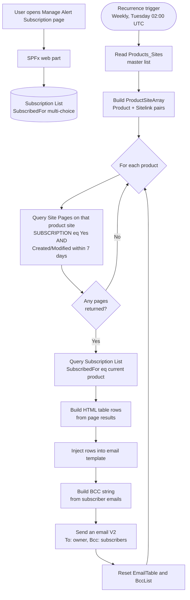

# SharePoint Subscription Updates Web Part (SPFx) & Power Automate Flow

<div align="center">
  
  
  
  
</div>

## Overview: Subscription Management for Microsoft 365

The **Subscription Updates** application is a self-service digest solution designed for global digital workplaces. It empowers distributed teams to seamlessly manage their project, product, or news subscription preferences directly from any **SharePoint Online** page. 

By automating communications across different regions, this solution ensures your international workforce stays informed without information overload.

**Architecture Breakdown**:
- **SPFx Web Part (Frontend)**: Provides a modern, responsive user interface (UI) for managing subscriptions within the SharePoint intranet.
- **Power Automate Cloud Flow (Backend)**: A scheduled, robust flow handles the background automation—scanning SharePoint Site Pages for updates and distributing branded HTML email digests to global subscribers.

### Three Moving Parts
1. **SPFx Web Part**: The user interface where users manage their own subscriptions.
2. **SharePoint Lists**: Two lists that hold configuration (master products list) and subscriber data.
3. **Power Automate Flow**: A scheduled cloud flow that scans product sites for page updates and sends a branded HTML digest to subscribers.

[picture of the solution in action, if possible]

## Used SharePoint Framework Version


## Applies to

- [SharePoint Framework](https://aka.ms/spfx)
- [Microsoft 365 tenant](https://docs.microsoft.com/sharepoint/dev/spfx/set-up-your-developer-tenant)

## Prerequisites

- **SharePoint Site**: To host the configuration and subscription lists.
- **Product Sites**: One SharePoint site per product, each with a Site Pages library.
- **Site Pages Extension**: The Site Pages library on every product site must be extended with:
  - `SUBSCRIPTION` (Choice column)
  - `PageUpdate` (Text column)
- **Power Platform Environment**: With Dataverse for importing the Power Automate solution.
- **Connections**: A licensed account for SharePoint and Office 365 Outlook connection references.
- **Site Collection App Catalog**: Access to deploy the SPFx package.

## High Level Flow



## Features

This extension provides a highly customizable experience for subscription management:

### 1. Flexible Data Source Selection
Administrators can configure the web part to point to any site and list within the SharePoint environment. It supports granular column mapping for:
- **Topics**: A Choice column used to populate the subscription options.
- **Subscriber**: A Person column to track who signed up.
- **Subscription Date**: A Date/Time column for auditing entry points.

### 2. Premium Branding & Layout
- **Themed Title Bar**: Inherits the site's primary theme color.
- **Title Bar Opacity**: Slider to adjust transparency.
- **Custom Icon**: For the SharePoint web part picker.
- **Optimized Layout**: Clean spacing between components.

### 3. Dynamic Typography Management
Adjust the font size of: Web Part Title, Description Text, Action Button Label, Section Labels, and Notifications.

### 4. Customizable Content & Messaging
- **Dynamic Text**: Use placeholders like `<userinfo>` in descriptions and notifications to display the current user's email.
- **Label Customization**: Editable labels for subscription sections and buttons.
- **Top-Aligned Notifications**: Prominent success and failure messages.

## Data Management & Storage

All configuration and subscription data are securely stored within standard SharePoint Lists:
- **Master Configuration List**: Defines the products and their respective site URLs.
- **Subscription List**: Stores individual user subscription preferences (products they subscribed to).

## Configuration & Sample Data

### 1. Master Configuration List (Products_Sites)

This list defines the products and their corresponding site URLs that the Power Automate flow scans.

| Column Name | Type                | Description                                              |
| ----------- | ------------------- | -------------------------------------------------------- |
| Title       | Single line of text | Item title (default column, often left blank)            |
| Products    | Choice              | The product name (e.g., 'SG-Teams', 'SharePoint Online') |
| Sitelink    | Single line of text | The absolute SharePoint site URL for this product        |

### 2. Subscription List

This list stores individual user subscription preferences and powers the SPFx web part UI.

| Column Name      | Type                | Description                                                                                     |
| ---------------- | ------------------- | ----------------------------------------------------------------------------------------------- |
| Title            | Single line of text | Auto-populated as "Subscription for {Display Name}"                                             |
| SubscribeBy      | Person or Group     | The user who is subscribing (used by flow for email BCC list)                                   |
| SubscribeOn      | Date and Time       | Timestamp of first subscription                                                                 |
| SubscribedBy     | Single line of text | User deduplication key (enforce unique values) to prevent multiple rows per user                |
| SubscribedFor    | Choice (Multi)      | The products the user wants (e.g., 'SG-Teams', 'SharePoint Online')                             |

### Local Testing Configuration

Ensure you have updated your `config/serve.json` file to point to your development tenant's workbench. Example configuration:

```json
{
  "$schema": "https://developer.microsoft.com/json-schemas/spfx-build/spfx-serve.schema.json",
  "port": 4321,
  "https": true,
  "initialPage": "https://<tenant-placeholder>.sharepoint.com/sites/<site-placeholder>/_layouts/15/workbench.aspx"
}
```

## Email Template Overview

The digest emails generated by the flow use an inline-CSS, table-based HTML design tailored for Outlook. Features include:
- **Header**: Full-width dark banner with the product name and week-ending date.
- **Content Table**: Displays the page title (hyperlinked) and the "What You Need to Know" summary (`PageUpdate`).
- **Footer**: Includes a "Manage Subscription" call-to-action button linking directly to the SPFx web part.

## Operating the Service

- **For Content Owners**: Write or edit a page on a product site, fill in the `PageUpdates` column with a summary, and set `SUBSCRIPTION` to `Yes`. The page will automatically be included in the next weekly digest.
- **For Subscribers**: Users can update their preferences via the "Manage Subscription" button in any digest email. Changes take effect on the next scheduled run.
- **For Flow Owners**: Check run history periodically. A successful run with no emails sent usually means no pages were flagged for subscription that week.

## Setup and Deployment

1. **Create Configuration Lists**: Set up the Master Configuration List and Subscription List on the host site.
2. **Extend Site Pages**: Add `SUBSCRIPTION` (Choice) and `PageUpdate` (Text) columns to the Site Pages library of every product site.
3. **Deploy SPFx Web Part**: Upload the `.sppkg` file to the site collection App Catalog and add it to your subscription management page.
4. **Import Power Automate Solution**: Import the Dataverse solution into your environment and configure the connection references for SharePoint and Office 365 Outlook.
5. **Update Flow Parameters**: Modify hardcoded values in the flow such as site URLs, list GUIDs, and the test `To` address before activating the flow.

## Solution

| Solution             | Author(s) |
| -------------------- | --------- |
| subscription-updates |           |

## Version history

| Version | Date | Comments        |
| ------- | ---- | --------------- |
| 1.0     |      | Initial release |

## Disclaimer

**THIS CODE IS PROVIDED _AS IS_ WITHOUT WARRANTY OF ANY KIND, EITHER EXPRESS OR IMPLIED, INCLUDING ANY IMPLIED WARRANTIES OF FITNESS FOR A PARTICULAR PURPOSE, MERCHANTABILITY, OR NON-INFRINGEMENT.**

---

## Minimal Path to Awesome

- Clone this repository
- Ensure that you are at the solution folder
- in the command-line run:
  - `npm install -g @rushstack/heft`
  - `npm install`
  - `npm run start` (or `heft start`)

Other build commands can be listed using `heft --help`.

## Troubleshooting

- **Diagnostic Logging**: Check the browser's developer console (F12) for entries prefixed with `[SubscriptionUpdates]` to see target lists, queries, and user identities.
- **Unique ID Column Mapping**: If user resolution fails in complex environments, create a Text column (e.g., `UserEmail`), and map it in the web part properties under **Unique ID Column (Optional)**.

## References

- [Getting started with SharePoint Framework](https://docs.microsoft.com/sharepoint/dev/spfx/set-up-your-developer-tenant)
- [Use Microsoft Graph in your solution](https://docs.microsoft.com/sharepoint/dev/spfx/web-parts/get-started/using-microsoft-graph-apis)
- [Heft Documentation](https://heft.rushstack.io/)